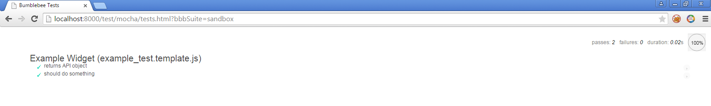
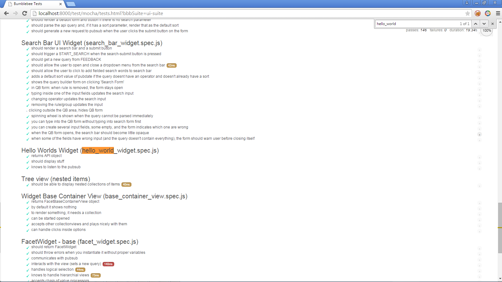

Hello World Example
===================


Alright! Let's develop a widget and let's do it quick!

First, basics - make sure we do the git stuff:

```bash
  $ git pull  # synchronize with the latest changes from github
  $ git checkout -b beautiful-widget  # create a new branch
```

Now, without thinking (doubting, criticizing, questioning our supreme authority!) create a test. Yes, you've heard 
well, we don't even have a widget to test, but we start from the test anyway:


```bash
  $ cp test/mocha/example_test.template.js test/mocha/widgets/beautiful_widget.spec.js
```  


And since we are lazy (which is virtue), we'll also create a ```sandbox``` test suite. This will
help us run tests quickly (and foremost, you will see the widget in action in no time!)

```bash
  $ cp test/mocha/suite.template.js test/mocha/sandbox.js
```

Now, edit your ```sandbox.js```:

```javascript
var tests  = [
    'test/mocha/widgets/beautiful_widget.spec.js'
  ];
``` 

Ok, we are almost done! Start the development server, open your browser and take a moment to congratulate yourself
(padding your shoulder...no, not on the head!)

```bash
  $ grunt server
  $ chrome http://localhost:8000/test/mocha/tests.html?bbbSuite=sandbox
```
  
You should see something like this:
  
  
  
  
If you don't see anything, then you have been paying too much attention to that lecture on quantum chromodynamics 
and screw things up! (@#$!) Open a developer console in your browser and look for errors, most likely paths are
wrong.


Next phase
==========

Congratulations! Almost done. Now you have to sit down and *actually* think what your widget is going to do. Write
the specification (the tests) down and then the widget itself.

I've prepared an (annoying heavily) annotated example which will guide you:

  - [hello world specs](../src/js/widgets/hello_world/widget.js)
  - [hello world widget](../test/mocha/js/widgets/hello_world_widget.js)
  
  
After the widget is ready, add it to the ui-suite.js and check it plays nicely with other widgets by visiting

http://localhost:8000/test/mocha/tests.html
http://localhost:8000/test/mocha/coverage.html

You should see 0 failures for the first link. And if you plan to submit a pull request, then at least 80% coverage
next to your widget name in the second page.



You can get the test/coverage report also on command line

```bash
  $ grunt coverage
```
  
I reassure you that writing a widget is much more fun that writing this how-to. Good job! Cheers, have fun!     